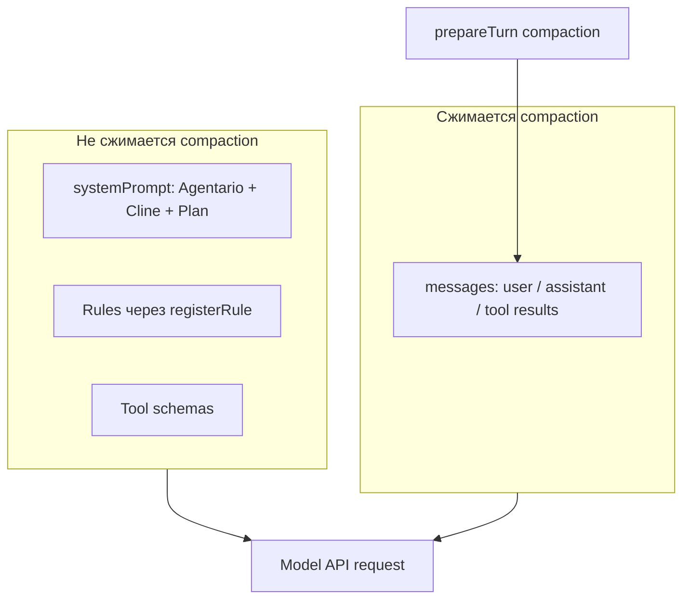
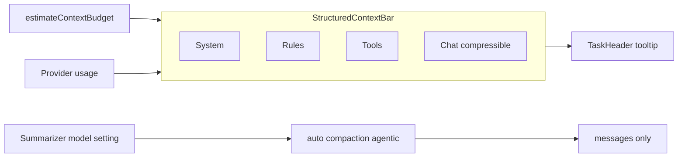

# Структурная полоска контекста + agentic-summary (0.5.0)

## Текущее состояние



- **Compaction** уже работает только над `messages[]` ([`compaction.ts`](sdk/packages/core/src/extensions/context/compaction.ts)); `systemPrompt` и rules **не попадают** в `runBasicCompaction` / `runAgenticCompaction`.
- Agentario включает авто-сжатие со стратегией **`basic`** ([`cline-session-factory.ts`](apps/vscode/src/sdk/cline-session-factory.ts) ~773–779).
- Полоска в TaskHeader показывает один агрегат `lastApiReqTotalTokens / contextWindow` ([`ContextWindow.tsx`](apps/vscode/webview-ui/src/components/chat/task-header/ContextWindow.tsx), [`getApiMetrics.ts`](apps/vscode/src/shared/getApiMetrics.ts)).
- Rules уже имеют структуру `## {filename}` ([`rules.ts`](sdk/packages/core/src/runtime/safety/rules.ts)), но в UI не отображаются отдельно.
- SDK уже содержит **`agentic`** strategy с LLM-summary ([`agentic-compaction.ts`](sdk/packages/core/src/extensions/context/agentic-compaction.ts)) и `CoreCompactionSummarizerConfig` для отдельной модели ([`config.ts`](sdk/packages/core/src/types/config.ts)).

---

## Целевая архитектура



| Категория | Источник | Сжимается? |
|-----------|----------|------------|
| **System** | overlay + Cline prompt + язык + Plan | Нет |
| **Rules** | enabled rules из watcher (per-file в tooltip) | Нет |
| **Tools** | JSON schemas активных tools | Нет |
| **Chat** | transcript messages | Да (agentic summary) |

---

## Фаза 1 — UI с категориями

### 1.1 SDK: тип и оценка бюджета

**Новый модуль** [`sdk/packages/core/src/extensions/context/context-budget.ts`](sdk/packages/core/src/extensions/context/context-budget.ts):

- Экспорт типа `ContextBudgetBreakdown`:
  - `contextWindow`, `totalEstimated`, `pinnedEstimated`, `compressibleEstimated`
  - `categories: { system, rules, tools, chat }`
  - `rulesDetail?: { name, tokens }[]`
- Функция `estimateContextBudget(input)` на базе существующего `createTokenEstimator()` из [`compaction-shared.ts`](sdk/packages/core/src/extensions/context/compaction-shared.ts):
  - **system** — `config.systemPrompt` (base, до merge rules)
  - **rules** — сумма enabled rules; детализация через `listEnabledRulesFromWatcher` + `formatRulesForSystemPrompt` per rule
  - **tools** — `JSON.stringify(tools)` + char→token heuristic (`estimateTokens`)
  - **chat** — sum over `messages` / `apiMessages`

**Рефакторинг** [`session-runtime-orchestrator.ts`](sdk/packages/core/src/runtime/orchestration/session-runtime-orchestrator.ts):

- `composeSystemPrompt()` → `composeSystemPromptParts(): { base, rules, combined }` (rules по-прежнему merge в `combined` для API).
- В `createRuntimePrepareTurn` **после** compaction, перед model call — вычислять budget и вызывать `context.emitStatusNotice?.("context-budget", breakdown)`.

Экспорт типа также из `@cline/core` / `@cline/shared` (минимальный shared-контракт для VS Code).

### 1.2 VS Code adapter: доставка в webview

**Расширить** [`ClineApiReqInfo`](apps/vscode/src/shared/ExtensionMessage.ts):

```ts
contextBudget?: ContextBudgetBreakdown
```

**[`message-translator.ts`](apps/vscode/src/sdk/message-translator.ts):**

- Обработать agent `notice` с metadata `kind: "context-budget"` → сохранить последний budget в `MessageTranslatorState`.
- При событии `usage` — merge budget в `buildApiReqInfoFromUsage()` (один `api_req_started` JSON с tokens + breakdown).

**[`getApiMetrics.ts`](apps/vscode/src/shared/getApiMetrics.ts):**

- `getLastContextBudget(messages)` — парсит `contextBudget` из последнего `api_req_started`.
- `getLastApiReqTotalTokens` — prefer provider total; fallback `contextBudget.totalEstimated`.

### 1.3 Webview UI

**Новый компонент** `StructuredContextBar.tsx` (заменяет логику отрисовки в [`ContextWindow.tsx`](apps/vscode/webview-ui/src/components/chat/task-header/ContextWindow.tsx)):

- **Segmented progress bar** — 4 сегмента пропорционально категориям (system / rules / tools / chat); chat визуально помечен как «сжимаемый».
- **Tooltip** ([`ContextWindowSummary.tsx`](apps/vscode/webview-ui/src/components/chat/task-header/ContextWindowSummary.tsx)) — accordion по категориям + раскрываемый список rules по файлам.
- Показывать «Pinned» vs «Chat (compressible)» totals.
- i18n: [`ru.ts`](apps/vscode/webview-ui/src/i18n/locales/ru.ts) / `en.ts`.

**[`TaskHeader.tsx`](apps/vscode/webview-ui/src/components/chat/task-header/TaskHeader.tsx):**

- Прокинуть `contextBudget` из `ChatView`.
- Вернуть `useAutoCondense` из extension state (убрать hardcoded `false`).

**[`ChatView.tsx`](apps/vscode/webview-ui/src/components/chat/ChatView.tsx):**

- `useMemo` для `getLastContextBudget(modifiedMessages)`.

**Тесты:** unit для `estimateContextBudget`, `getLastContextBudget`, snapshot/RTL для segmented bar.

---

## Фаза 2 — Agentic summary только для чата

### 2.1 SDK: надёжность agentic

**[`compaction.ts`](sdk/packages/core/src/extensions/context/compaction.ts):**

- Если `strategy === "agentic"` и summarizer вернул пустой результат / throw → **fallback на `basic`** (log + telemetry tag `fallback: "basic"`).
- Для малых окон (LM Studio 8k–32k): уменьшить `preserveRecentTokens` пропорционально `maxInputTokens` (например `min(20_000, maxInputTokens * 0.25)`).

Compaction по-прежнему **не трогает** system/rules/tools — только `context.messages`.

### 2.2 Agentario: настройки и wiring

**Новые ключи state** ([`state-keys.ts`](apps/vscode/src/shared/storage/state-keys.ts)):

| Ключ | Default | Назначение |
|------|---------|------------|
| `compactionStrategy` | `"agentic"` | `"basic"` \| `"agentic"` |
| `compactionSummarizerProviderId` | `undefined` | провайдер summary (если пусто — как у агента) |
| `compactionSummarizerModelId` | `undefined` | модель summary |

**[`cline-session-factory.ts`](apps/vscode/src/sdk/cline-session-factory.ts):**

```ts
compaction: {
  enabled: useAutoCondense,
  strategy: compactionStrategy ?? "agentic",
  summarizer: resolveSummarizerFromSettings(apiConfig), // CoreCompactionSummarizerConfig
}
```

**[`sdk-compaction.ts`](apps/vscode/src/sdk/sdk-compaction.ts)** (manual `/compact`): читать strategy + summarizer из session config, не hardcode basic.

**Settings UI** — [`FeatureSettingsSection.tsx`](apps/vscode/webview-ui/src/components/settings/sections/FeatureSettingsSection.tsx):

- Toggle «Авто-сжатие» (существующий `useAutoCondense`).
- Select «Стратегия сжатия»: Basic / Agentic (LLM summary).
- Блок «Модель для summary» (provider + model picker, переиспользовать LM Studio picker / generic model selector; placeholder «как у агента»).

Proto: расширить `UpdateSettingsRequest` + conversion в [`updateSettings.ts`](apps/vscode/src/core/controller/state/updateSettings.ts).

### 2.3 UX compaction events

- Agent `notice` `"auto-compacting"` / `"compacting"` → краткий info в чат (уже частично через SDK `emitStatusNotice`; проверить mapping в translator → `say: "info"`).
- После compact — обновить structured bar (новый budget event).

---

## Версионирование и docs

- Bump **0.5.0** (MINOR): [`package.json`](apps/vscode/package.json), [`CHANGELOG.md`](CHANGELOG.md), [`README.md`](README.md), [`release/notes/v0.5.0.md`](release/notes/v0.5.0.md).
- Обновить [`config/PROMPTS_AND_RULES.md`](config/PROMPTS_AND_RULES.md) — секция «Контекст и сжатие»: категории, agentic vs basic, отдельная модель summary.

---

## Порядок реализации

1. SDK: `ContextBudgetBreakdown` + `estimateContextBudget` + `composeSystemPromptParts` + emit notice.
2. VS Code: translator + `ClineApiReqInfo` + getters.
3. Webview: `StructuredContextBar` + i18n + TaskHeader wiring.
4. SDK: agentic fallback + adaptive `preserveRecentTokens`.
5. Agentario: state keys, session factory, manual compact, Settings UI для strategy + summarizer model.
6. Tests, docs, bump 0.5.0, `build.cmd`.

---

## Риски и ограничения

- **Оценки токенов** — heuristic (chars/4), не 100% совпадение с провайдером; после `usage` event total уточняется, breakdown остаётся estimated (подписать в tooltip «≈»).
- **Agentic summary** — дополнительный API-запрос к LM Studio; отдельная модель (ваш выбор) снижает нагрузку на основную модель, но требует второй loaded model или unload/load.
- **SDK build**: изменения в `sdk/packages/core` требуют `bun run build:sdk` перед сборкой VSIX.
